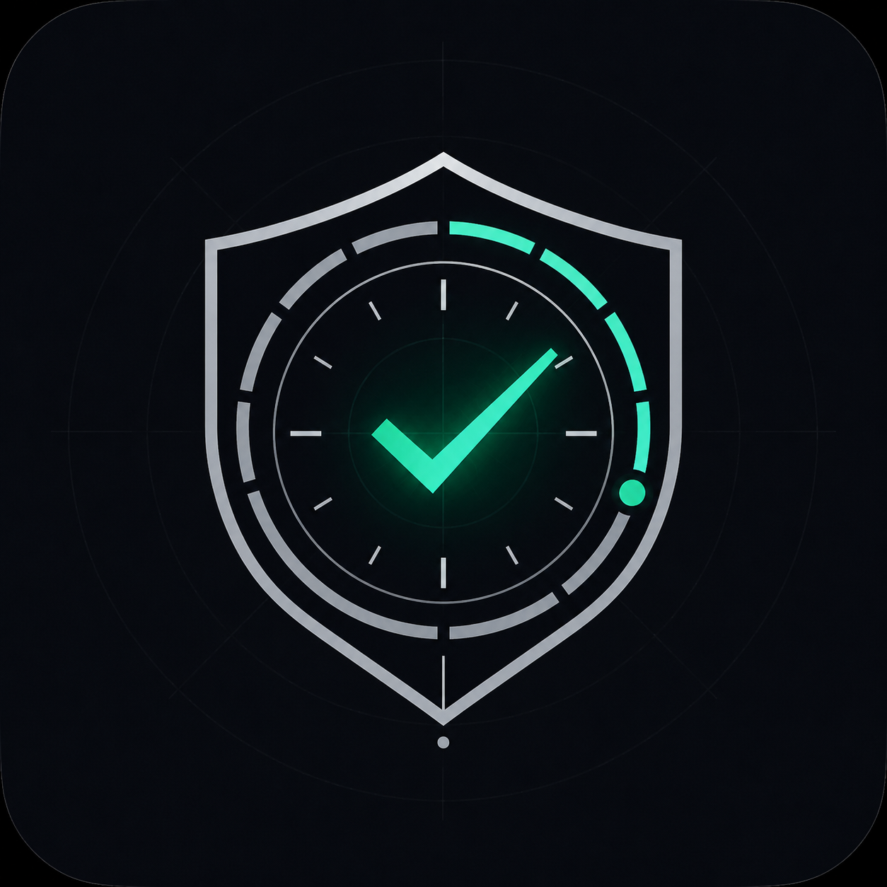
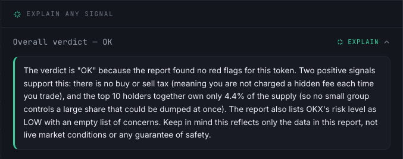
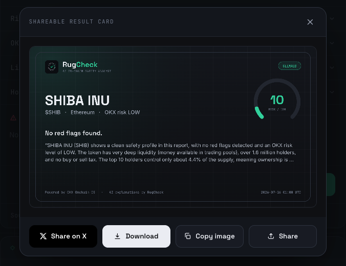

<div align="center">
  

  # RugCheck

  **An AI on-chain safety analyst.** Paste a token address — RugCheck reads it against OKX
  on-chain security data and explains, in plain English, whether it's safe, shaky, or a trap.

  <sub>Built as an ASP (Agent Service Provider) for the OKX.AI Genesis Hackathon.</sub>
</div>

---

RugCheck is **AI-native, not a data dashboard.** A deterministic engine produces the facts and the
verdict; an AI analyst then reasons *about* those facts — an executive summary, every risk explained
(what it means / why it matters / the consequence), risks prioritized into critical / important /
minor, a confidence score, scam-pattern recognition, and a conversational follow-up. Crucially, the
AI **can only explain data that's already in the report** — it never invents prices, holders, or
flags, and never gives financial advice.


<!-- placeholder: verdict dial + AI report, with an inline "Explain" expanded -->

## How it works

```
Token address
      ↓
OKX Onchain OS  (Web3 API / onchainos)     ← facts
      ↓
Risk Engine  (analyze.js)                  ← deterministic verdict 🟢/🟡/🔴 + score  (authoritative)
      ↓
AI Analyst  (ai.js → OpenRouter)           ← explain · prioritize · confidence · scam-pattern · chat
      ↓
Web report + interactive layer (page.js)   ← "Explain this" per signal · shareable card · Post on X
```

The deterministic layer is the source of truth. The AI layer is **additive**: if the AI is
unavailable (no key or an error), the deterministic scan still returns in full. The grounding rule
is enforced in the system prompt — the model explains the report and nothing else.

## Features

- **Verdict + risk dial** — `OK` / `CAUTION` / `AVOID` with a 0–100 score; OKX `riskLevel` is authoritative.
- **AI analyst report** — executive summary, per-risk breakdown, tiered prioritization, confidence, scam-pattern watch.
- **Explain This** — an *Explain* button on every major signal (verdict, score, risk level, liquidity,
  holders, each flag). It asks a grounded question through the existing chat endpoint, expands the
  answer inline, and **caches it** so re-opening never costs another AI call.
- **Conversational chat** — ask follow-ups grounded in the report ("which issue is worst?").
- **Share Card + Post on X** — a branded, high-resolution result card you can download, copy, or share;
  the X button opens a prefilled `#OKXAI` post and copies the card image to paste in.
- **Beginner / Trader / Developer modes** — the same facts, reframed for the audience.
- **Wrong-chain / not-found guard** — a token with no data returns a clear "check the address and
  chain" message instead of a fake clean verdict.
- **Nice touches** — one-click example tokens, copy-address + chain-aware explorer links, recent scans,
  skeleton loading, and toasts.


<!-- placeholder: the exported result card, sized for X -->

## HTTP API

| Method | Route | Description |
|---|---|---|
| `GET` | `/` | Self-contained demo web UI |
| `GET` | `/docs` | Developer documentation page |
| `GET` | `/health` | `{ ok: true }` — liveness (use for uptime pings) |
| `GET` | `/ai-status` | Whether the AI layer is enabled + the model |
| `GET` | `/rugcheck?address=&chain=&ai=1&mode=` | Deterministic report (+ optional AI analysis) |
| `POST` | `/chat` | Grounded follow-up: `{ report, messages, mode }` |
| `POST` | `/mcp` | **MCP endpoint** (Streamable HTTP, stateless) — exposes a `rugcheck` tool for agents (OKX.AI A2MCP) |
| `GET` | `/logo.png` | Brand logo / favicon |

The `/mcp` endpoint speaks JSON-RPC (`initialize` · `tools/list` · `tools/call`) and exposes one tool,
`rugcheck(address, chain, include_ai, mode)`, returning the same report as `/rugcheck` (as both a text
block and `structuredContent`). It's the machine-facing surface; humans use the UI and `/rugcheck`.

`chain` accepts `ethereum`, `bsc`, `base`, `arbitrum`, `polygon`, `optimism`, `avalanche`, `solana`.
`mode` is `beginner` | `trader` | `developer`. Deep links auto-run: `/?address=0x…&chain=bsc&mode=trader`.

## Quick start

```bash
git clone <this-repo> rugcheck-asp && cd rugcheck-asp
cp .env.example .env          # fill in your keys (see Configuration)
npm start                     # → http://localhost:8787
```

Terminal-only (deterministic scan, no server):

```bash
node cli-check.js 0xA0b86991c6218b36c1d19D4a2e9Eb0cE3606eB48 ethereum
```

**Zero npm dependencies** — the OKX HTTP calls and the AI layer both use plain `fetch`.

## Configuration

All config is via environment variables in `.env` (git-ignored — never commit it).

| Variable | Required | Purpose |
|---|---|---|
| `OKX_API_KEY` `OKX_API_SECRET` `OKX_API_PASSPHRASE` `OKX_PROJECT_ID` | for deploy | OKX Web3/DEX API credentials (the HTTP data path) |
| `OPENROUTER_API_KEY` | for AI | Enables the AI analyst layer |
| `OPENROUTER_MODEL` | optional | Model slug (default `anthropic/claude-opus-4.8`) |
| `RUGCHECK_SOURCE` | optional | Force `http` or `cli` (default: `http` when `OKX_API_KEY` is set, else `cli`) |
| `PORT` | optional | Server port (default `8787`) |

**Data source:** locally, RugCheck can use the `onchainos` CLI (if installed + logged in). Set the
`OKX_*` keys to use the **OKX Web3 HTTP API** instead — that's what a deploy uses, since the CLI
can't run on a host. Get OKX Web3/DEX API keys at [web3.okx.com](https://web3.okx.com); get an
OpenRouter key at [openrouter.ai/keys](https://openrouter.ai/keys).

Without an OpenRouter key, RugCheck still runs — it just shows the deterministic verdict without the
AI explanation layer.

## Deploy

RugCheck is a single Node web service, so it runs as-is on **Render** (or Railway / Fly.io / Cloud Run):

1. Push this repo to GitHub and create a Render **Web Service** from it (build `npm install`, start `npm start`).
2. Add the environment variables from the table above in the Render dashboard.
3. Optional (free tier): point a free uptime monitor (e.g. UptimeRobot) at `https://<app>.onrender.com/health`
   every ~10 min so the instance doesn't cold-start.

> Vercel is not a good fit — it's built for serverless functions, and this is a persistent HTTP server.

## Disclaimer

RugCheck reports factual on-chain data from OKX Onchain OS. **It is not investment advice.** Always
do your own research.

---

<sub>Hackathon build notes and progress live in [DEVLOG.md](DEVLOG.md). · MIT licensed.</sub>
